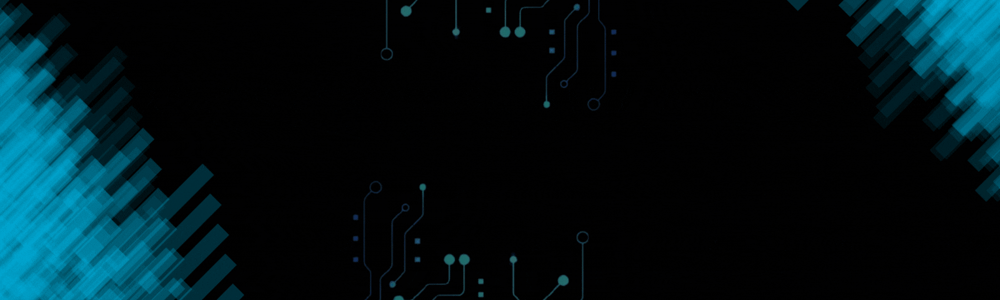

###

<h4 align="center">I Am A Passionate Frontend Developer Skilled In Modern Web Technologies, Focused On Building Responsive And User-Friendly Websites. I Enjoy Learning New Technologies And Creating Full-Stack Applications That Deliver The Best User Experience. Always Ready To Take On Innovative Projects And Embrace New Challenges 💻</h4>

###

  
  
  
  

###

 

  
  
  
  
  
  
  
  
  
  
  
  
  
  
  
  
  
  
  
  
  
  
  

###

 

  
  
  

###
